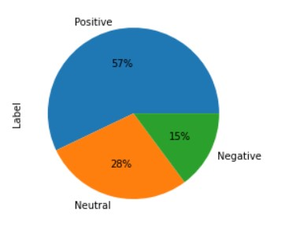

<h1 align="center">Saijyoti Tripathy</h1>
 

   <a href= "https://www.linkedin.com/in/saijyoti-tripathy/">LinkedIn</a>
   <a href= "https://github.com/SaijyotiTripathy">GitHub</a>
   <a href= "mailto:tripathysaijyoti02@gmail.com?subject=Hello%20Saijyoti,%20From%20Github">Gmail</a>
   <a href= "https://leetcode.com/Crimson07/">LeetCode</a>

<h4 align="center">Goal oriented, persistant, determined and focused computer science student with a keen eye for details. Curious about learning the dynamics between machine and human with an understanding of data science, machine learning and artificial intelligence.</h4>

## Education 
- Silicon Institute of Technology, Bhubaneswar
   - BTech in **Computer Science and Engineering** (2020-2024)
   - CGPA : 9.56
- Indian Institute of Technology, Madras
   - BSc in **Data Science and Programming** (2021-2024)
   - CGPA : 9.0

## Projects

### [Sentimental Analysis on National Education Policy 2020 tweets (SANEP2020)](https://github.com/SaijyotiTripathy/SANEP2020)
- This project aims to figure out the general opinion on NEP 2020 and which may be used to make better strategies and plan for the future.
- Trained and implemented Bernoulli Naive Bayes, XGBoost , Logistic Regression and Decision Tree for developing the model and concluded Decision Tree works better with an accuracy of 91%.

### [Real-time Human Object Detection](https://github.com/SaijyotiTripathy/Real-time-Human-Object-Detection)
- Real-time human object detection system implemented on input videos and live video streams can be used for smart security surveillance.
- This project uses pre-trained yolov3 models taken from official yolo paper which was released in 2018.

### [Heart Attack Analysis and Prediction](https://github.com/SaijyotiTripathy/Heart-Attack-Analysis-and-Prediction)
- Trained and implemented Logistic Regression for developing the predictive model.
- Model is able to predict heart attack with 81.5% accuracy.

## Skills
- **Languages:** C, Python, Java
- **Areas of Interest:** Deep Learning, Artificial Intelligence
- **Others:** Statistics, Mathematics, Supervised Learning

## Interest
- Reading
- Foreign Languages
- Music
